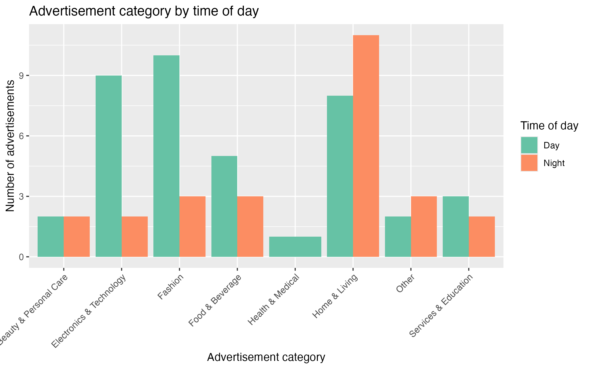
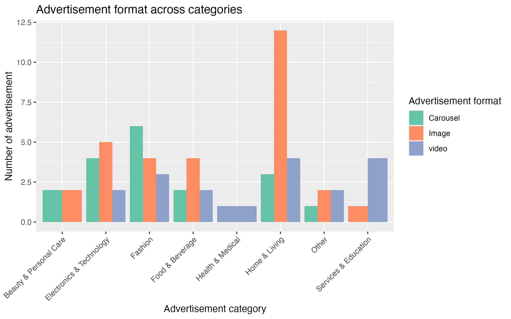
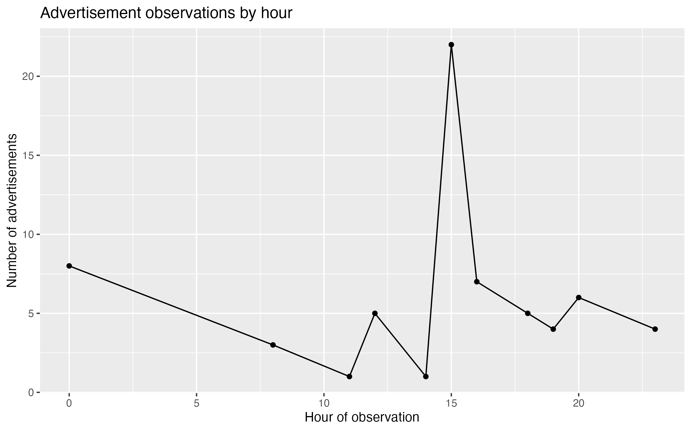

<script src="https://code.jquery.com/jquery-3.7.1.min.js" integrity="sha256-/JqT3SQfawRcv/BIHPThkBvs0OEvtFFmqPF/lYI/Cxo=" crossorigin="anonymous"></script>

```{r setup, include=FALSE}
knitr::opts_chunk$set(echo=FALSE, message=FALSE, warning=FALSE, error=FALSE)
```

```{js}
$(function() {
  $(".level2").css('visibility', 'hidden');
  $(".level2").first().css('visibility', 'visible');
  $(".container-fluid").height($(".container-fluid").height() + 300);
  $(window).on('scroll', function() {
    $('h2').each(function() {
      var h2Top = $(this).offset().top - $(window).scrollTop();
      var windowHeight = $(window).height();
      if (h2Top >= 0 && h2Top <= windowHeight / 2) {
        $(this).parent('div').css('visibility', 'visible');
      } else if (h2Top > windowHeight / 2) {
        $(this).parent('div').css('visibility', 'hidden');
      }
    });
  });
})
```

```{css}
.figcaption {display: none}

body {
  background-color: #f7fbf7;
}

h1 {
  text-align : center;
  padding: 20px;
  color: #2f6f4e;
}

h2 {
  color: #2f6f4e;
  padding-top: 15px;
}
```

## What kinds of Instagram advertisements appeared?


This visualisation shows how Instagram advertisement categories varied between day and night. Home & Living advertisements appeared more frequently at night, while categories such as Electronics & Technology were more commonly observed during the day. This suggests that advertisement timing may differ depending on the target audience and product type.


## Which advertisement formats were used across categories?


This visualisation compares the advertisement formats used across different categories. Image advertisements appeared most frequently overall, especially within the Home & Living category. carousel and video advertisements were observed less often, suggesting that static image advertisements may be the most commonly used format in these observations.


## When were advertisements observed?



This visualisation uses the timestamp data collected from the Google Form responses. The number of observed Instagram advertisements increased noticeably during the afternoon, especially around 3pm. This may indicate that advertisements appeared more frequently during active browsing periods later in the day.


